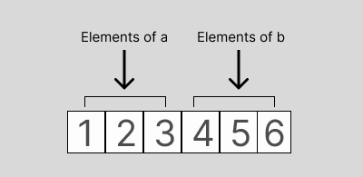
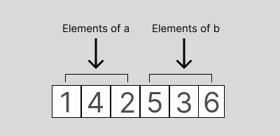
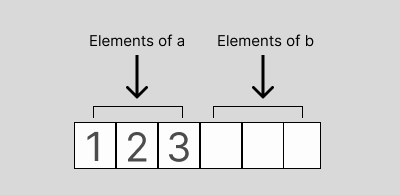
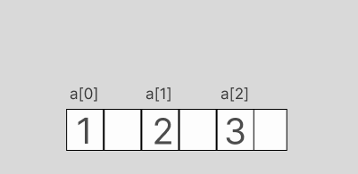

# Multidimensional ndarrays memory layout (order)

## Order  

`order` is the parameter given the `numpy.array` in order (:)) to choose how the array is stored in memory, both  `Pyccel` supported orders are stored contiguously in memory, they differ in the order.
`order='F'` would tell `numpy` to store the array column by column (column-major), example:
```python
import numpy as np

if __name__ == "__main__":
  a = np.array([[1, 2, 3],
                [4, 5, 6],
                [7, 8, 9]], order='F')
  print(a.ravel('K'))
```
`array.ravel('k')` shows us how the array is actually stored in memroy, this python program will output `[1 4 7 2 5 8 3 6 9]`, notice that the columns are stored one after the other.  

`order='C'` on the other hand would tell `numpy` to store the array row by row, example:
```python
import numpy as np

if __name__ == "__main__":
  a = np.array([[1, 2, 3],
                [4, 5, 6],
                [7, 8, 9]], order='C') # order='C' is the default in numpy.array
  print(a.ravel('K'))
 ```
This python program will output `[1 2 3 4 5 6 7 8 9]`, notice that the rows are stored one after the other.

### printing and indexing in `numpy`

`order` in `numpy` doesn't not affect the indexing or the printing, unlike `transposing`, the `shape` of the array remains the same, only the `strides` change, example:
```python
import numpy as np

if __name__ == "__main__":
   a = np.array([[1, 2],
                [4, 5],
                [7, 8]], order='F')
   b = np.array([[1, 2],
                [4, 5],
                [7, 8]], order='C')
   print(a.shape, a.strides) # output: (3, 2) (8, 24)
   print(b.shape, b.strides) # output: (3, 2) (16, 8)
   print(a)
   # output:[[1 2]
   #         [4 5]
   #         [7 8]] 
   print(b)
   # output:[[1 2]
   #         [4 5]
   #         [7 8]]
   
   print(a[2][1], a[0][0], a[1]) # output: 8 1 [4 5]
   print(b[2][1], b[0][0], b[1]) # output: 8 1 [4 5]
```
`arr.strides` is how the printing and indexing occures, the strides of an array tell us how many bytes we have to skip in memory to move to the next position along a certain axis (dimension). For example for `memory_layout_of_a = [1 4 7 2 5 8]` and `strides_of_a = (8, 24)`, we have to skip 8 bytes (1 value for `int64`) to move to the next row, but 24 bytes (3 values for `int64`) to get to the same position in the next column of `a`.  
`a[2][1]` would give us `'8'`, using the `strides`: `2 * 8 + 1 * 24 = 40`, which means that in the flattened array, we would have to skip `40` bytes to get the value of `a[2][1]`, each element is 8 bytes, so we would have to skip `40 / 8 = 5` elements, from `1` to `5` to get to `'8'`


### Ordering in C
For `C`, arrays are flattened into a one dimensional string, `strides` and `shape` are used to navigate the array.
While the `order_c` `ndarrays` only require a simple copy to be created/populated, `order_f` arrays require an extra step, which is transposing the array.  
Example:  
  `order_c`  
    1.  allocate `order_c` `ndarray`  
    2.  copy values to `ndarray`  
  `order_f`  
    1. allocate temporary `order_c` `ndarray`  
    2. copy values to temporary `ndarray`  
    3. allocate `order_f` `ndarray`  
    4. copy temporary `ndarray` to final `ndarray` using `strides` and `shape`, this will create a transposed version of the temporary `ndarray`

### Indexing in C

For indexing, the function `GET_ELEMENT(arr, type, ...)` is used, indexing does not change with `order`.  
If we take the following 2D array as an example:
|   |   |   |
|---|---|---|
| 1 | 2 | 3 |
| 4 | 5 | 6 |

with `array.rows = 2` and `array.columns = 3`  
`GET_ELEMENT(arr, int32, 0, 1)` which is equivelant to `arr[0][1]` would return `2` no matter the `order`.  

To loop efficiently in an (`order_c`) array, we would do this:
```c
for (int i = 0; i < array.rows; ++i)
{
  for (int j = 0; j < array.columns; ++j)
  {
    printf("-%d-", GET_ELEMENT(array, int32, i, j);
  }
}
```

For (`order_f`) we would do this:

```c
for (int i = 0; i < array.columns; ++i)
{
  for (int j = 0; j < array.rows; ++j)
  {
    printf("-%d-", GET_ELEMENT(array, int32, i, j);
  }
}
```

### Ordering in Fortran
// TODO

## ndarrays (obsolete)
`ndarrays` are stored as contiguous data in memory to increase efficiency
We use `copy_array_data(t_ndarray *dest, t_ndarray *src, t_uint32 offset, enum order)` to achieve this whether the order is `order_f` or `order_c`.

Taking as an example: `ab = array([a, b])` where `a = array([1, 2, 3])` and `b = array([4, 5, 6])`  

`ab` would be stored like this in `order_c`:


  

and like this in `order_f`:  

  

## Calls to `array_copy_data`

Taking as an example: `ab = array([a, b])` where `a = array([1, 2, 3])` and `b = array([4, 5, 6])`  

For `order_c`:
after allocating space for the ndarray `ab` (and supposing that arrays `a` and `b` have already been created), we would call:
  1. ```array_copy_data(ab, a, 0, order_c)```, this will copy `a` to `ab` starting from `index=0` + `offset`, to `index=size-of(a)` + `offset`, and since `offset` is 0, `a` will be copied starting from `index=0` to `index=3`, the result is:  



  2. ```array_copy_data(ab, b, order_c)```, this will copy `b` to `ab` starting from `index=0` + `offset`, to `index=size-of(b)` + `offset`, and since `offset` is 3 (size-of(b)), `a` will be copied to `ab` starting from `index=3` to `index=6`, the result is:  


For `order_f`:
after allocating space for the ndarray `ab` (and supposing that arrays `a` and `b` have already been created), we would call:  
 1. ```array_copy_data(ab, a, 0, order_f)```, this will copy N elements of `a` (N=size-of(`a`)) into their correct memory position using strides and shape, so it will be copying one element to `index=0` + `offset`, but jumping one to copy the next element to `index=2` + `offset`, the result is:  
 
 

 2. ```array_copy_data(ab, b, 1, order_f)```, This will do the same for `b`, but since the `offset` is 1, the copying will start from `index=0` + 1, this will result in the final array:  

  
 
 ## Nested arrays handling (for now)
