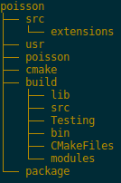

.. _specs:

The Pyccel Compiler
===================

Typical processing using **Pyccel** can be splitted into 3 main stages:

1. First, we parse the *Python* file or text, and we create an *intermediate representation* (**IR**) that consists of objects described in **pyccel.parser.syntax**
2. Most of all these objects, when it makes sens, implement the property **expr**. This allows to convert the object to one or more objects from **pyccel.ast.core**. All these objects are extension of the **sympy.core.Basic** class. At the end of this stage, the **IR** will be converted into the *Abstract Syntax Tree* (AST). 
3. Using the **Codegen** classes or the user-friendly functions like **fcode**, the **AST** is converted into the target language (for example, *Fortran*)

.. note:: Always remember that **Pyccel** core is based on **sympy**. This can open a very wide range of applications and opportunities, like automatically evaluate the *computational complexity* of your code. 

.. note:: There is an intermediate step between 2 and 3, where one can walk through the AST and modify the code by applying some recursive functions (ex: mpify, openmpfy, ...)

.. todo:: add diagram

.. .. tikz:: Overview of a code generation process using Fortran as a backend/target language. 
.. 
..   \node[draw=black, rectangle, fill=red!40] (py)  
..   at (0,0)  {Python};
.. 
..   \node[draw=black, rectangle, fill=red!20, font=\fontsize{10}{10.2}] (lint)  
..   at (0,2)  {Pylint};
.. 
..   \node at (0.9,0) [color=gray,above=3mm,right=0mm] {Parser};
.. 
..   \draw[black, thick, fill=blue!10] (3,0) circle [radius=0.5cm];
..   \node at (3,0) [color=black] {\textsc{IR}};
..   \node at (3.8,0) [color=gray, above=3mm, right=0mm, font=\fontsize{10}{10.2}] {\texttt{expr}};
..   \node at (3.6,0) [color=gray, below=3mm, right=0mm, font=\fontsize{10}{10.2}] {\textit{property}};
.. 
..   \draw[black, thick, fill=blue!30] (6,0) circle [radius=0.7cm];
..   \node at (6,0) [color=black] {\textsc{AST}};
..   \node at (6.7,0) [color=gray,above=3mm,right=0mm] {Codegen};
.. 
..   \node[draw=black, rectangle, fill=green!20] (f90)  
..   at (9.5,0)  {Fortran};
.. 
..   \draw[->,very thick] (py) --(2.5,0) ;
..   \draw[->,very thick] (3.5,0)--(5.3,0) ;
..   \draw[->,very thick] (6.7,0)--(f90) ;
..   \draw[->,very thick] (py) --(lint) ;

The idea behind **Pyccel** is to use the available tools for **Python**, without having to implement everything as it is usually done for every new language. The aim of using such high level language is to ensure a user-friendly framework for developping massively parallel codes, without having to work in a hostile environment such as *Fortran* or an obscur language like *c++*. Most of all, compared to other *DSLs* for HPC, all elements and parallel paradigms of the language are exposed.

Among the very nice tools for *Python* developpers, Pylint_ is used for **static** checking. This allows us to avoid writing a **linter** tool or having to implement an advanced tool to handle **errors**. Following the **K.I.S.S** paradigm, we want to keep it *stupid* and *simple*, hence if you are getting errors with *Pylint*, do not expect *Pyccel* to run!! We assume that you are capable of writing a **valid** *Python* code. If not, then try first to learn *Python* before trying to do fancy things!

.. _Pylint: https://www.pylint.org/

Compiling a single file
***********************

TODO

Syntax analysis
^^^^^^^^^^^^^^^

Semantic analysis
^^^^^^^^^^^^^^^^^

Code generation
^^^^^^^^^^^^^^^

Backend compilation
^^^^^^^^^^^^^^^^^^^

Setting up a project
********************

The root directory of a Pyccel collection of pyccel sources
is called the :term:`source directory`.  This directory also contains the Pyccel
configuration file :file:`conf.py`, where you can configure all aspects of how
Pyccel converts your sources and builds your project. 

Pyccel comes with a script called :program:`pyccel-quickstart` that sets up a
source directory and creates a default :file:`conf.py` with the most useful
configuration values. Just run ::

   $ pyccel-quickstart -h

for help.

For example, runing::

   $ pyccel-quickstart poisson

will create a directory **poisson** where you will find, inside it:

   Structure of the **poisson** project after running :program:`pyccel-quickstart`.

Defining document structure
***************************

Let's assume you've run :program:`pyccel-quickstart` for a project **poisson**.  It created a source
directory with :file:`conf.py` and a directory **poisson** that contains a master file, :file:`main.py` (if you used the defaults settings). The main function of the :term:`master document` is to
serve as an example of a **main program**.

Adding content
**************

In Pyccel source files, you can use most features of standard *Python* instructions.
There are also several features added by Pyccel.  For example, you can use multi-threading or distributed memory programing paradigms, as part of the Pyccel language itself.

Running the build
*****************

Now that you have added some files and content, let's make a first build of the
project.  A build is started with the :program:`pyccel-build` program, called like
this::

   $ pyccel-build application 

where *application* is the :term:`application directory` you want to build.

|more| Refer to the :program:`pyccel-build man page <pyccel-build>` for all
options that :program:`pyccel-build` supports.

Notice that :program:`pyccel-quickstart` script creates a build directory :term:`build directory` in which you can use **cmake** or :file:`Makefile`. 
In order to compile *manualy* your project, you just need to go to this build directory and run ::

   $ make

Basic configuration
*******************

.. todo:: add basic configurations.

.. Earlier we mentioned that the :file:`conf.py` file controls how Pyccel processes
.. your documents.  In that file, which is executed as a Python source file, you
.. assign configuration values.  For advanced users: since it is executed by
.. Pyccel, you can do non-trivial tasks in it, like extending :data:`sys.path` or
.. importing a module to find out the version you are documenting.
.. 
.. The config values that you probably want to change are already put into the
.. :file:`conf.py` by :program:`pyccel-quickstart` and initially commented out
.. (with standard Python syntax: a ``#`` comments the rest of the line).  To change
.. the default value, remove the hash sign and modify the value.  To customize a
.. config value that is not automatically added by :program:`pyccel-quickstart`,
.. just add an additional assignment.
.. 
.. Keep in mind that the file uses Python syntax for strings, numbers, lists and so
.. on.  The file is saved in UTF-8 by default, as indicated by the encoding
.. declaration in the first line.  If you use non-ASCII characters in any string
.. value, you need to use Python Unicode strings (like ``project = u'Exposé'``).
.. 
.. ..  |more| See :ref:`build-config` for documentation of all available config values.

Contents
********

.. toctree::
   :maxdepth: 1 

   syntax
   semantic
   codegen
   project
   rules

.. rubric:: Footnotes

.. |more| image:: ../include/more.png
          :align: middle
          :alt: more info

