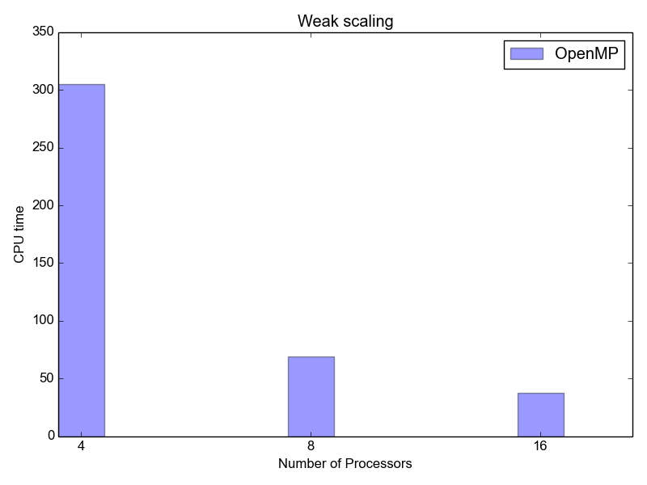
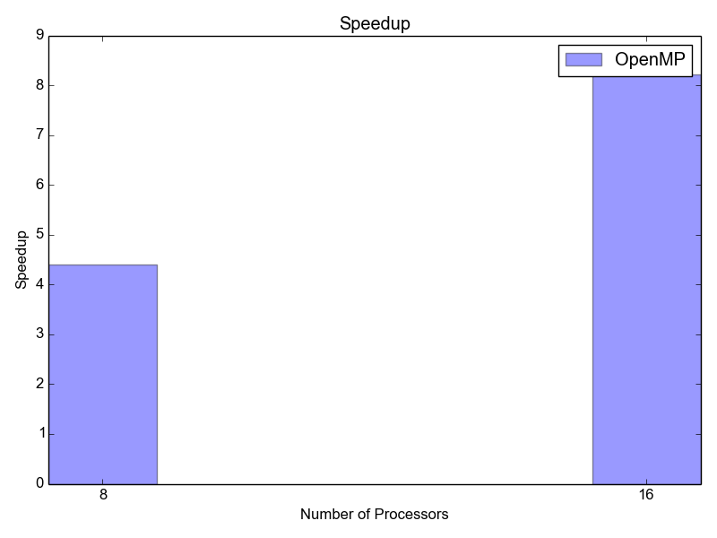

.. highlight:: rst

First Steps with Pyccel
=======================

This document is meant to give a tutorial-like overview of Pyccel.

The green arrows designate "more info" links leading to advanced sections about
the described task.

By reading this tutorial, you'll be able to:

* compile a simple *Pyccel* file

* get familiar with parallel programing paradigms 

* create, modify and build a *Pyccel* project.

Install Pyccel
**************

Pyccel sources can be found on https://github.com/pyccel/pyccel.

you first need to install all Python dependencies::

  $ sudo python3 -m pip install -r requirements.txt
    
then you install Pyccel:

* **Standard mode**::

  $ python3 -m pip install .

* **Development mode**::

  $ python3 -m pip install --user -e .

this will install a *python* library **pyccel** and a *binary* called **pyccel**.

.. |todo|:: add installation using **pip**

For the moment, *Pyccel* generates only *fortran* files. Therefor, you need to have a *fortran* compiler. To install **gfortran**, run::

  $ sudo apt install gfortran

In order to use the commands :program:`pyccel-quickstart` and :program:`pyccel-build`, you will need to install **cmake**::

  $ sudo apt install cmake 

Simple Examples
***************

In this section, we describe some features of *Pyccel* on simple examples.

Hello World
^^^^^^^^^^^

Create a file *helloworld.py* and copy paste the following lines (be careful with the indentation)

.. code-block:: python

  def helloworld():
      print('Hello World !!')
    
  helloworld()

    
Now, run the command::

  pyccel helloworld.py

This will generate a *Fortran* code in helloworld.f90

.. execute_code::
    :hide_headers:
    :hide_code:
    :output_language: fortran
    :filename: scripts/f_helloworld.py

Matrix multiplication
^^^^^^^^^^^^^^^^^^^^^

Create a file *matrix_multiplication.py* and copy paste the following lines

.. execute_code::
    :hide_headers:
    :hide_code:
    :output_language: python
    :filename: scripts/py_matrix_mul.py
    
Now, run the command::

  pyccel matrix_multiplication.py

This will parse the *Python* file, generate the corresponding *Fortran* file

The generated *Fortran* code is

.. execute_code::
    :hide_headers:
    :hide_code:
    :output_language: fortran
    :filename: scripts/f_matrix_mul.py
    
        

Functions and Subroutines
^^^^^^^^^^^^^^^^^^^^^^^^^

Create a file *functions.py* and copy paste the following lines

.. execute_code::
    :hide_headers:
    :hide_code:
    :output_language: python
    :filename: scripts/py_functions.py

Now, run the command::

  pyccel functions.py 

This will parse the *Python* file, generate the corresponding *Fortran* file::

Now, let us take a look at the *Fortran* file

.. execute_code::
    :hide_headers:
    :hide_code:
    :output_language: fortran
    :filename: scripts/f_functions.py

Matrix multiplication using OpenMP
^^^^^^^^^^^^^^^^^^^^^^^^^^^^^^^^^^

.. |todo|:: a new example without pragmas

Create a file *mxm_omp.py* and copy paste the following lines

.. execute_code::
    :hide_headers:
    :hide_code:
    :output_language: python
    :filename: scripts/py_mxm_omp.py

Now, run the command::

  pyccel mxm_omp.py 

This will parse the *Python* file, generate the corresponding *Fortran* file::

    Now, let's  take a look at the *Fortran* file
    
.. execute_code::
    :hide_headers:
    :hide_code:
    :output_language: fortran
    :filename: scripts/f_mxm_omp.py
    
The following plot shows the scalability of the generated code on **LRZ** using :math:`(n,m,p) = (5000,7000,5000)`.

   Weak scalability on LRZ. CPU time is given in seconds.

   Speedup on LRZ

.. |todo|:: add an example of poisson solver with MPI

More topics to be covered
*************************

- :doc:`Pyccel extensions <pyccelext/index>`:

  * :doc:`pyccelext/math`,
  * :doc:`pyccelext/numpy`,
  * :doc:`pyccelext/scipy`,
  * :doc:`pyccelext/mpi4py`,
  * :doc:`pyccelext/h5py`,
  * ...

- :doc:`Pyccel compiler <compiler/index>`:

  * :doc:`compiler/project`,
  * :doc:`compiler/rules`,

