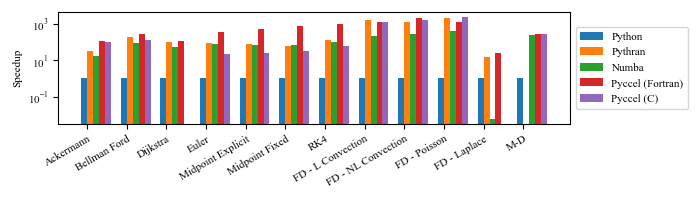
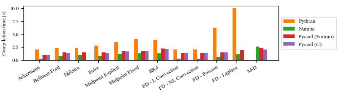

# Summary

The Python programming language has gained significant popularity in scientific computing and data science, mainly because it is easy to learn and provides many scientific libraries, including parallel ones.
While these libraries are very fast, they are usually written in compiled languages such as Fortran and C/C++.
User code written in pure Python is usually much slower; because Python is a dynamically typed language which introduces overhead in many basic operations.
Due to this limitation, one often needs to rewrite the computational parts of their Python code in a statically typed language, to take full advantage of optimization and acceleration techniques.
This expensive process happens naturally during the transition from a prototype to a production code, which is the principal bottleneck in scientific computing.
We believe that such a bottleneck can be resolved, or at least drastically reduced, through the use of automatic code generation tools.

In this work we present Pyccel, a Python library which acts as a transpiler by translating Python code to either Fortran or C code, and as an accelerator by making the generated code callable from Python once again.
Not only is the Pyccel-generated Fortran or C code very fast, but it is human-readable; hence the expert programmer can easily profile the code on the target machine and further optimize it.
Pyccel provides a variety of methods for the efficient usage of the available hardware resources, such as type annotations, function decorators, and OpenMP pragmas.
Moreover, Pyccel allows the user to link their code to external libraries written in the target language.

# Statement of need

Different approaches have been proposed to accelerate computation-intensive parts of Python code.
Cython [@Cython2011], one of the first tools of this kind, allows the user to call the Python C API by introducing a static typing approach.
However, the user must re-write their code into a hybrid Python-C language in order to remove expensive Python callbacks from the generated C code.
As a result, the code can no longer be executed using the Python interpreter alone.
A more recent tool is Pythran [@Pythran2015], which allows dynamic Python code to be converted into static C++ code by providing types as comments.
The HOPE [@HOPE2015] library provides a just-in-time (JIT) compiler to convert Python code to C++, where the arguments' types are only known at execution time.
Numba [@NUMBA] follows the same idea of bringing  JIT compiling to Python by generating machine code based on LLVM, which can run on either CPUs or GPUs.
Both Numba and HOPE rely heavily on the use of simple decorators to instruct the Python package to compile a given function. They also use the type information available at runtime to generate byte code.
A different approach is given by PyPy [@PyPy2009], a Python interpreter written in an internal language called RPython (which is a restricted subset of the Python language itself).
The aim of PyPy is to provide speed and efficiency at runtime using a JIT compiler.

To the authors' knowledge, of all the different methods used to accelerate Python codes, nothing so far generates human readable code.
In this work, we present a new Python static compiler named Pyccel which combines a transpiler with a Python/C API to create an accelerator.
This approach has two main advantages.
Firstly, it leaves the user the option of optimising the code further in the low-level language with the help of HPC specialists.
Secondly, it allows the user to choose the language the most adapted to their problem or system.
For example, Fortran is a language designed for scientific programming and is tailored for efficient runtime execution on a wide variety of processors.
The compiler is therefore highly effective for array handling in the context of scientific programming.
In contrast, the C compiler is more adapted to support GPU tools such as CUDA, and OpenACC.

Pyccel is designed for two different use cases:
(1) accelerate Python code by converting it to Fortran and providing a CPython wrapper to interface between the low-level and high level languages,
(2) generate low-level C or Fortran code from Python code.
The latter case follows from the fact that the code is human-readable.
This means that Pyccel can also be used to simplify the process of going from a prototype (which is often written in inefficient languages which are quick to write) to production code (written in a low-level language).
To this end, Pyccel is designed to allow the use of low-level legacy codes and some Python scientific libraries such as numpy, scipy, etc.

# Benchmarks

A few example codes are used to provide an indication of the performance of Pyccel as compared to alternative accelerators.
The source code can be found in \url{github.com/pyccel/pyccel-benchmarks}.
These examples, which illustrate several common scientific computing problems, are based on open-source example codes [@JBurkhardt; @CFD].

Figure \autoref{fig:execution} shows the time required to execute the accelerated code for these test cases.
The tests were run with python 3.10.
We see that Pyccel is highly competitive when compared to the existing accelerators Numba [@NUMBA] and Pythran [@Pythran2015].

Another important consideration is the time spent waiting for the accelerated version to be generated.
Here too Pyccel is shown to be very competitive, outperforming pythran significantly for large files.

# Acknowledgments

TODO: Funding sources

The authors would like to thank all the people who have contributed to Pyccel so far.

# References
